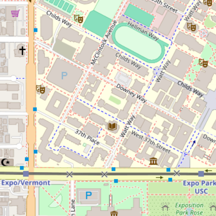
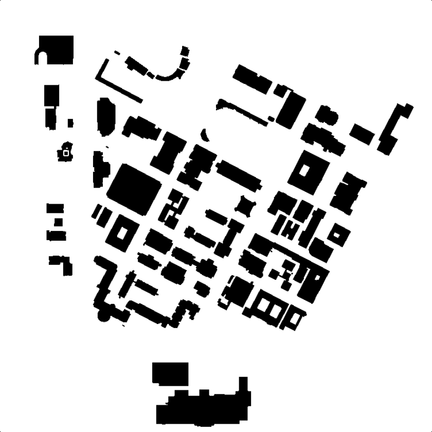
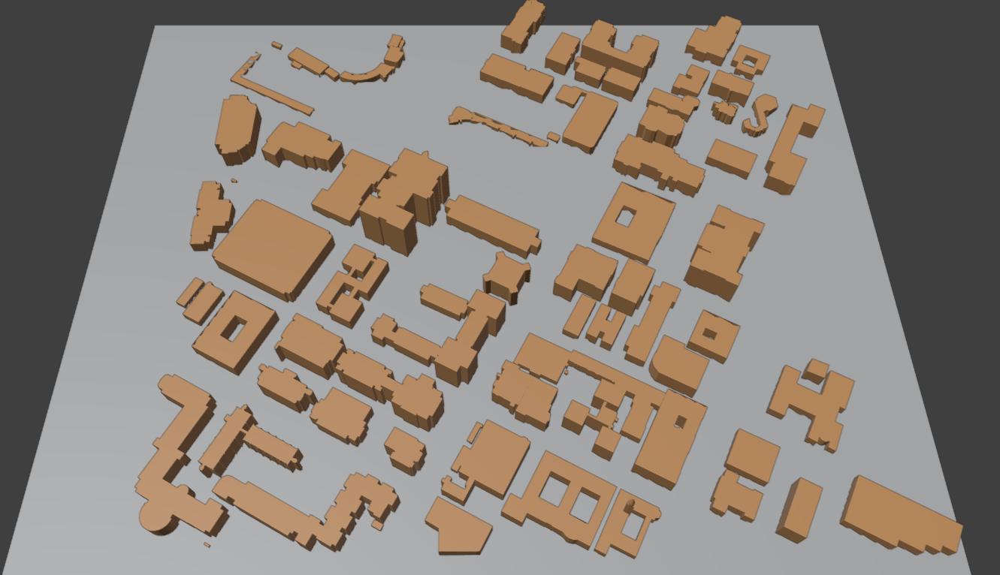

# PMNet with SionnaRT: Pathloss Map Prediction

### Overview

This README provides comprehensive instructions for training a PMNet model using the Sionna RT dataset. The process involves generating cropped images from the USC campus Sionna RT scene and training a neural network to predict path loss or power maps.

### Sionna Data

 <br/>


we use a 3D USC campus model obtained from Blender OSM. These models are then exported to the produce scenes in sionna RT.


### Data Preparation


1. **TX Configuration**:
    - 104 TX points distributed across the USC campus scene
    - Task is to generated power maps, city maps, and tx maps for each TX point
2. **Image Generation**:
    - Power maps: Grayscale images representing power over regions of interest (RoI)
        - Range: -250dBm to 0dBm
        - Grayscale mapping: -250dBm $\rightarrow$ 0, 0dBm $\rightarrow$ 255
    - City maps: Grayscale images showing RoI and buildings
        - Range: 0 to 255
        - Grayscale mapping: 0 $\rightarrow$ Altitude of buildings, 255 $\rightarrow$ ROI
    - TX maps: Indicate TX point locations with a white $5\times5m^2$ square on black background
        - White square (255) indicates TX point
        - Black background (0) indicates RoI and buildings
3. **Cropping**:
    - Images cropped into 256x256 pixels, ensuring inclusion of TX point
    - Approximately 6,455 cropped images for each type of map.
#### **How to Prepare Data**
To prepare the pathloss data set, simply run the following script. Please replace `[START]` and `[END]` with the TX points you want to start and end data mining with. A bigger range will require a lot of memory. A good estimate to have is a range of 5. In order to mine data for all 104 TX, you can run the file updating the `[START]` and `[END]` arguments.
```
python Data/preprocess.py [START] [END]
```

### Running the Model

We train a PMNet model by stacking the cropped city map and tx map in the `data/cropped` folder as input and predict the pathloss. Make sure the data is already present in the mentioned folder else follow the above section to prepare the data.
#### **Training**
To train PMNet, simply run the `train.py`.
```
python train.py
```
 
#### **Evaluating**
To train PMNet, simply run the `eval.sh` 
To evaluate {MNet}, refer to the following commands. Please update the path to model for evaluation. Similarly make sure the data is already present in the `data/cropped` folder else follow the above section to prepare the data.
```
python eval.py \
    --model_to_eval '[PATH_TO_MODEL]' 
```


### Data and Checkpoint

- **Data**:
    - **Uncropped Images**: [Uncropped images for visualization](https://drive.google.com/drive/folders/1AHCQtniNpr1DjGMYrWgwxddmQ3IXCgav?usp=drive_link)
    - **Cropped Images**: [Cropped images for training](https://drive.google.com/drive/folders/1E49AIF7q7LsQWHR68tGV_XJC7ubgplEs?usp=drive_link)
     - **Download Link**: [Cropped images for training](https://drive.google.com/file/d/1_39J6FnhmVIxsyBDQdCkIbN3cF09h9pz/view?usp=sharing)

- **Checkpoint**:
    - **Checkpoint**: [RMSE: 0.00158](https://drive.google.com/file/d/1nymEoDKlKGk1aOzm5pNgeTcSE9MG3YGV/view?usp=sharing)
