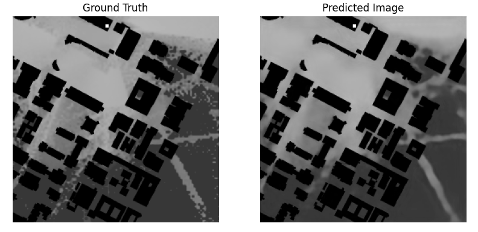
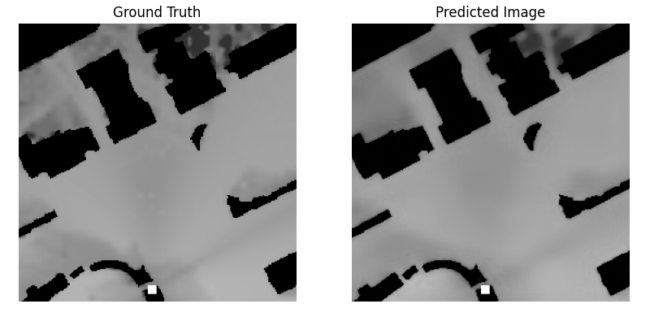
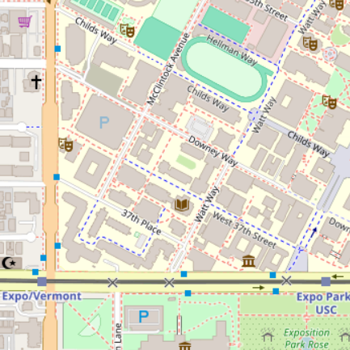
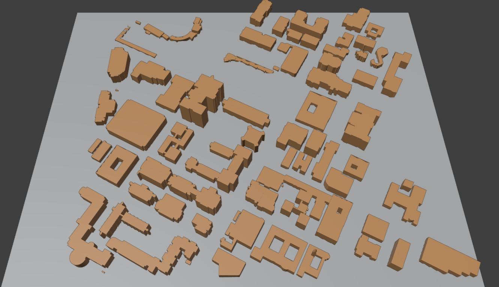

# PMNet with SionnaRT
## Overview

- This repository provides detailed instructions on the training of **PMNet**—an NN tailored for path loss map prediction. 
- The PMNet are trained with site-specific channel measurement data obtained through **Sionna RT**. 
- This training includes two main steps: 
    1. Generating path loss map dataset by utilizing **Sionna RT**; 
    2. Training **PMNet** with the pathloss map dataset to predict path loss map.

- *Example*: Ground Truth (**SionnaRT** measurement) vs. Predicted (**PMNet** prediction)

     </br>
    <!--  -->


## Dataset: SionnaRT-based Pathloss Map (USC Campus Area)

- A 3D map of the USC campus, created with *Blender OSM*, was utilized. These models were then exported to create scenes in **Sionna RT**.

     &nbsp; 
    
<!--  -->

### Pre-Processing

1. **Configuration (TX/RX/Channel/etc.)**:
    - *Details will be updated...*
2. **Map Generation**:
    - For each scene at a specific TX location, three types of maps are generated:
        1. **Pathloss Maps**: These are grayscale images that visualize pathloss (or pathgain) across regions of interest (RoI).
            - Gray conversion: $-255 \sim 0$ [dBm] pathgain $\rightarrow$ $55 \sim 255$ grayscale
        2. **City Maps**: These are grayscale images showing RoI and buildings.
            - Grayscale mapping: $0 \sim 54$ [m] height $\rightarrow$ $0 \sim 54$ grayscale and $255$ (White) gray value represent building and ROI area, respectively.
        3. **TX Maps**: These are grayscale images indicating the TX locations, which is highlited with $255$ (White) gray value.
3. **Cropping**:
    - Images cropped into 256x256 pixels, ensuring inclusion of TX point and are further augmented.
    - A total of $9164$ cropped images are produced for the USC campus map dataset.

> ***"How to Prepare (Pre-Process) Pathloss Map Data?"***
- To pre-process the pathloss map data, simply run the following script. 
Please replace `[START]` and `[END]` with the TX points you want to start and end data mining with. A bigger range will require a lot of memory. A good estimate to have is a range of 5. In order to mine data for all $158$ TX, you can run the file updating the `[START]` and `[END]` arguments. Additionally, the total number of TX points are $175$, out of which $17$ give NaN values in their coverage map which are automatically discarded.

    ```
    python data/preprocess.py [START] [END]
    ```


## Model: PMNet
- To train the PMNet model, we use stacked cropped City and TX maps from the data/cropped folder as input to predict the Pathloss map as the output.

> ***"How to Train?"***
- To train PMNet, simply run the `train.py`.

    ```
    python train.py
    ```
 
> ***"How to Evaluate?"***

- To evaluate a PMNet, refer to the following commands. Please update the path to model for evaluation. Similarly make sure the data is already present in the `data/cropped` folder else follow the above section to prepare the data.

    ```
    python eval.py \
        --model_to_eval '[PATH_TO_MODEL]' 
    ```


## Download: Dataset & Checkpoint

- **Dataset**:
    - **Full Dataset**: [.zip](https://drive.google.com/file/d/1FvRpNQts9SGYqbECSKAeFYSlba5LTnKK/view?usp=sharing)
    - **Uncropped**: [images](https://drive.google.com/drive/folders/1gOB7mPQ-q8BxqK6PO1c4cvH9_Rz11V5o?usp=sharing)
    - **Cropped**: [images](https://drive.google.com/drive/folders/1-0i8EKz9qas0jMea_vwmBboEwKHeUf0M?usp=sharing)
    

- **Checkpoint (Pre-trained PMNet)**:
    - **PMNet (RMSE: 0.00098)**: [ckpt](https://drive.google.com/file/d/1KPnsFpEv806nYO2sK3G4260zPP1xzcAO/view?usp=sharing)
